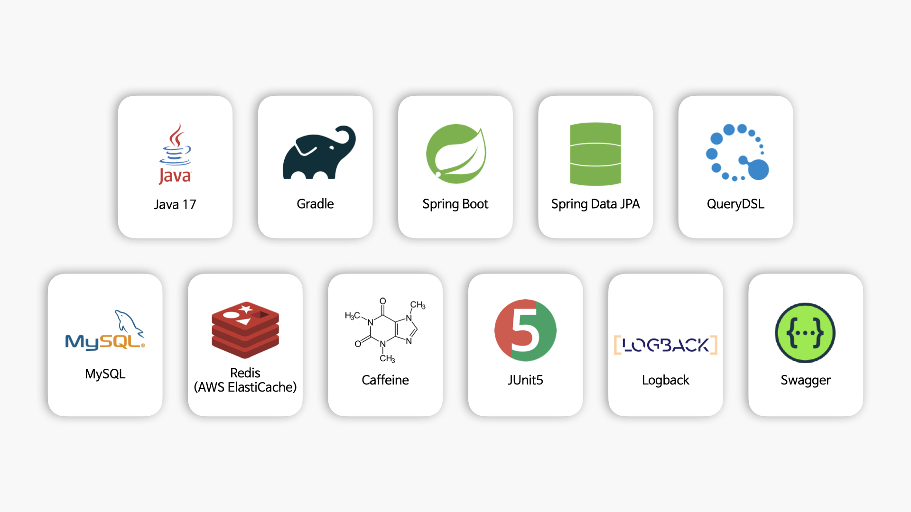
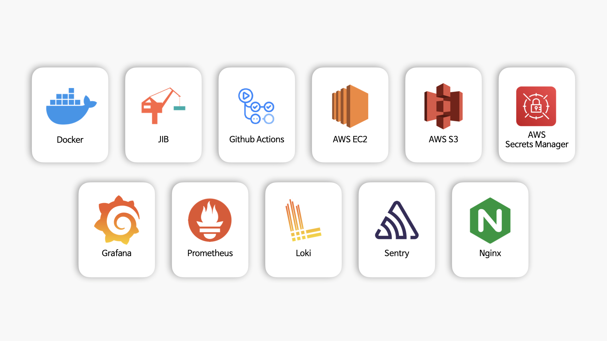
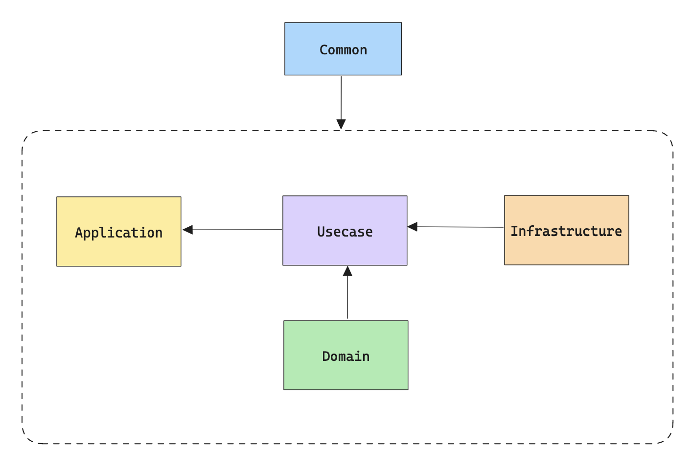
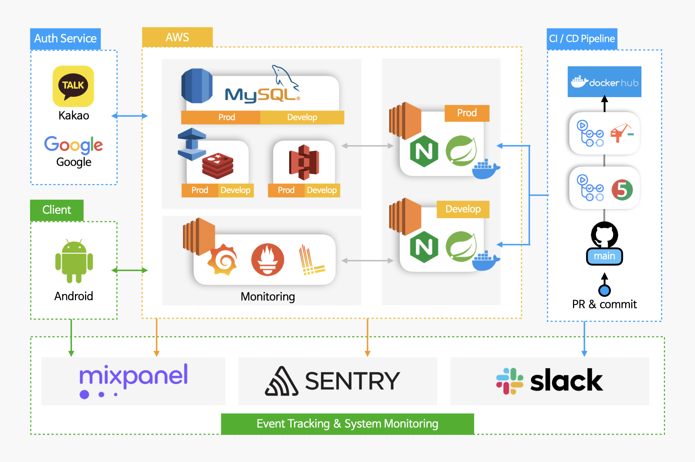

 

 

<h2> ⚾️ 내가 만드는 야구장 시야 확인 서비스, SPOT! 🏟️ </h2>

 

 

 

## 🧑‍💻 팀원 소개

|      신은지      |                                                           정준원                                                           |                                                            박민성                                                            |
| :------------: |:-----------------------------------------------------------------------------------------------------------------------:|:-------------------------------------------------------------------------------------------------------------------------:|
|  |  |  |
| BE |                                                         BE, 파트장                                                          |                                                          BE                                                           | 

 

## 🛠️ 백엔드 사용 기술

 

## ⚙️ 인프라 & DevOps 사용 기술

 

## 📁️ 프로젝트 설계

### 🧩 설계 원칙

1. `직관적` : 동료 개발자가 별도의 설명서가 없어도 프로그램을 이해하고 활용할 수 있어야 한다. 
2. `유연성` : 기존 기능의 변경, 또는 신규 기능의 추가가 용이해야 한다. 
3. `효율성` : 유저가 최소한의 latency로 서비스를 경험할 수 있어야 한다.

 

### ✨️ 패키지 - 멀티 모듈 아키텍처

| 모듈명 | 역할                                                                                                                 |
| --- |--------------------------------------------------------------------------------------------------------------------|
| common | 각 모듈에서 공통으로 사용해야 하는 코드들을 모아둔 모듈입니다. (ex. exception)                                                                |
| application | 프로그램 가동에 필요한 app들을 모아둔 모듈입니다. 현재는 user 서비스만 존재하지만, 추후 batch, admin 등 다양한 app이 추가될 수 있습니다.                          |
| domain | SPOT! 서비스 구현에 필요한 도메인 객체들을 모아둔 모듈입니다. POJO로 구성됩니다.                                                                 |
| usecase | SPOT! 서비스 구현에 필요한 비즈니스 요구사항들을 구현한 모듈입니다. port(interface)와 구현체를 분리해 DIP를 프로젝트 단위로 구현했습니다.                           |
| infrastructure | 외부 의존성을 갖는 코드들을 모아둔 모듈입니다. (ex. jpa, aws, redis..) usecase는 persistence, redis 구현체가 아닌 추상화에 의존하므로 외부 의존성 교체가 쉽습니다. |

 

### 🖥️ 시스템 아키텍처

 

## 🤔 기술적 의사결정

- SPOT! 서버 팀의 무한 스크롤링 구현방법 [>> Link](https://github.com/depromeet/SPOT-server/wiki/%EB%AC%B4%ED%95%9C-%EC%8A%A4%ED%81%AC%EB%A1%A4%EB%A7%81%EA%B3%BC-%ED%8E%98%EC%9D%B4%EC%A7%80%EB%84%A4%EC%9D%B4%EC%85%98)

 

## 📚 트러블슈팅

- Nginx http 301 redirection 설정 버그 픽스 [Issue #118](https://github.com/depromeet/SPOT-server/issues/118)
- M1 ARM Mac에서 Embedded Redis 실행 오류 버그 픽스 [Issue #173](https://github.com/depromeet/SPOT-server/issues/173)

 

## 📬 SPOT! 관련 문의는 아래 연락처로 부탁드려요!

- 문의사항 | [6jihaeng@gmail.com](mailto:6jihaeng@gmail.com)
- 인스타그램 | [@spot_baseballview](https://www.instagram.com/spot_baseballview/)
- 서비스 피드백하기 | https://forms.gle/NG2JSsSivTQkNVRE9
